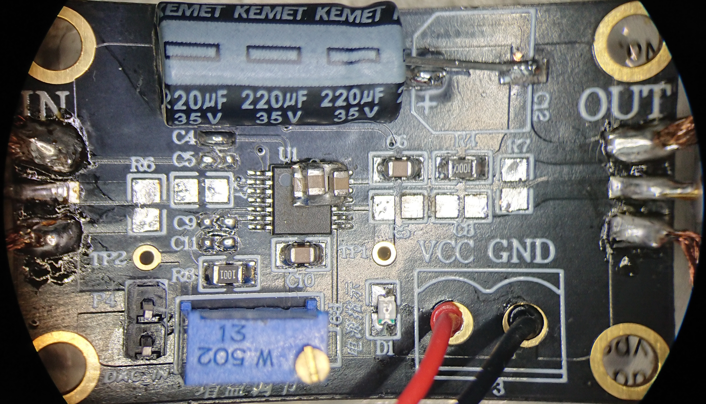
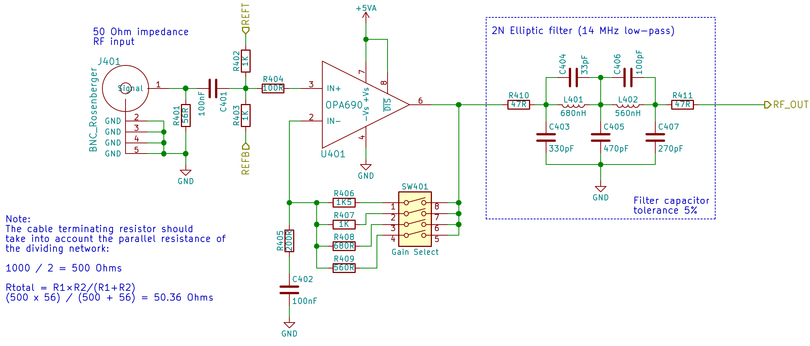

# Comparison of different capture setups used with vhs-decode

[vhs-decode](https://github.com/oyvindln/vhs-decode) is a way to decode RF captures of old video tapes. To do such captures, one needs a PC/Laptop with some kind of fast ADC, some kind of amplifier for the RF signal and a VCR that plays the actual tape and provides this raw RF signal. There are several possible hardware configurations for such a capture system. Some are already obsolete and have been replaced by better solutions. Some are alternatives without actual replacing other options. The most common capture setups shall be compared here.

***Currently work in progress and more of a brainstorming platform***

## Overview of equipment

### VCRs
Two different Video8 VCRs are available for testing, one Sony EV-S1000E and one Sony SLV-T2000. Tapes will be Video8 tapes from the year 1990 - 2000.

The Sony SLV-T2000 has a measured output impedance of 200 Ohm on its Video8 part. The Sony EV-S1000E has a hight output impedance of 1 kOhm. Therefore, more tests will be done on the EV-S1000E as the higher output impedance is more prone to disturbances caused by the low input impedance of a connected amplifier.

### old AD8367 amplifier
The old [AD8367 amplifier](https://github.com/tandersn/cxadc-hw-mod/wiki/AD8367-RMS-Setup) is not perfectly suited for the amplification of the RF signal of a VCR. It has a relatively low input impedance which can not matched to the output impedance of the VCR and might overload its RF signal. This will result in poor signal quality and can be seen in the image which will look worse as for example a crosshatch pattern can get visible.

#### Configuration for Sony EV-S1000E:
Domesday Duplicator gain of 8.5 (DIP switch set to 1000)
AD8367 gain cannot be determined due to use of potentiometer

https://discord.com/channels/665557267189334046/782578245408653313/1169038092661964871

Configuration of AD8367 amplifier is as following:
- Rout,load (R5): 150 Ohm
- Cin (C7) + Cout (C8): 47 uF

Which ad8367 board do you have?  If there is no resistor to ground on the input side of the amp, then yes, you can remove the jig capacitor.

For VHS and 28.6msps or higher sampling, the low pass filter is not required really, as the sample rate is high enough to capture the harmonics.

It does look like you used the amp mod from the 75 ohm setup and the card mod for the 200 ohm setup.  You have a few options:

#1) The easiest thing to do would probably be remove the 150R and replace it with 0R on the amp board.  Then you have the 50+165 = 215 (as long as it is below 225 it is fine per ad8367 datasheet).  You must use very short cables if you do this.

#2) Alternately,  leave the 150R on the amp board, take the 50R in series out of the circuit completely, remove the 2 330R from the card, and put the 75R back in R24 spot.

The 50R in series works in conjunction with the 165R (2x330R) on the card.  If you just leave the 50R in series without a resistor to ground on the CX card, you may not get ideal results.

For CX Card mod see: https://github.com/tandersn/cxadc-hw-mod/wiki/CX-CARD:-Modify-PCIe-CX-card-to-work-with-AD8367-(RMS-or-otherwise)

For Amp Board RMS mod see: https://github.com/tandersn/cxadc-hw-mod/wiki/AD8367:-RMS-amp-board-modification

### new ADA4857 amplifier
This variant is using this amplifier https://gitlab.com/wolfre/vhs-rf-amp-ada4857

It is configured to match the VCRs output impedance, which may differ from VCR to VCR. It is also set to a gain so that a possibly weak RF signal is amplified to a proper amplitude for the ADC.

#### Configuration for Sony EV-S1000E (1000 Ohm output impedance, Vpp = ***???*** mV):
Amplifier input impedance R11 & R12 (or R21 & R22): 15 kOhm

Amplifier gain of 6.6, Rin = R13 & Rf = R14 (or Rin = R23 & Rf = R24): Rin = 100 Ohm & Rf = 560 Ohm

Domesday Duplicator gain of 2.02 (DIP switch set to 1111)

#### Configuration for Sony SLV-T2000 (200 Ohm output impedance, Vpp = 260 mV):
Amplifier input impedance R11 & R12 (or R21 & R22): 3.3 kOhm

Amplifier gain of 6.6, Rin = R13 & Rf = R14 (or Rin = R23 & Rf = R24): Rin = 100 & Rf = 560 Ohm

### Domesday Duplicator
One [Domesday Duplicator](https://github.com/simoninns/DomesdayDuplicator) is available for testing.

#### Domesday Duplicator not modified

On the unmodified version, the Domesday Duplicator is identical to the hardware assembly as provided in the git. The input impedance is 50 Ohm which will cause a high load on the RF output of the VCR when not using a additional impedance matching circuit (like the ADA4857 amplifier).

#### Domesday Duplicator modification

On the modified version, the input filter/impedance and gain setting will be changed to match the VCRs output impedance and signal strength. This is usually done on the [ADA4857 amplifier](https://github.com/oyvindln/vhs-decode/wiki/CX-Cards#external-amplification). But as the Domesday Duplicator already has an amplifier on board, removing that additional ADA4857 amplifier might increase the signal quality or at least remove unnecessary circuitry.

C401 = increase to 47 uF

change R401 to 47 kOhm (or remove it completelly) and change R402 & R403 to 22 kOhm (or 33 kOhm when R401 is not assembled)

Change the total input impedance to 15 kOhm by changing R401 to xx Ohm. When taking R402 & R403 into account, this will result in a total input impedance of xx Ohm which matches the output impedance of the new ADA4857 amplifier.

A gain of 3.8 ... 6 should be suitable and can be set via the DIP switch on the DdD. No hardware change is required.

| Configuration | Switches | Gain |
| --- | --- | --- |
| 15 | 1111 | 2.02 |
| 7 | 0111 | 2.17 |
| 11 | 1011 | 2.27 |
| 13 | 1101 | 2.45 |
| 3 | 0011 | 2.54 |
| 14 | 1110 | 2.59 |
| 5 | 0101 | 2.79 |
| 6 | 0110 | 3.02 |
| 9 | 1001 | 3.04 |
| 10 | 1010 | 3.34 |
| 1 | 0001 | 3.8 |
| 12 | 1100 | 4 |
| 2 | 0010 | 4.4 |
| 4 | 0100 | 6 |
| 8 | 1000 | 8.5 |

 	 

### CX Card
Two [CX Cards](https://github.com/oyvindln/vhs-decode/wiki/CX-Cards) are available for testing, one with the CX23883-39, one with the 25800-112. The first on is [said to be a bit better in terms of capture quality, as it causes less electrical self noise](https://github.com/happycube/cxadc-linux3/wiki/Types-Of-CX2388x-Cards#cx-white-card-old-rca-s-video), therefore this one card will be used.

See https://gitlab.com/wolfre/cx25800-11z-cxadc-rework-measurements for further measurements on the CX cards.

The following standard modifications have been done on both cards:
- [Cooling Mod](https://github.com/oyvindln/vhs-decode/wiki/CX-Cards#cooling-mod): Added a heatsink to the CX-chip
- [C31 Removal](https://github.com/oyvindln/vhs-decode/wiki/CX-Cards#c31-removal): Remove C31 to increase SNR
- [RCA to BNC Replacement](https://github.com/oyvindln/vhs-decode/wiki/CX-Cards#rca-to-bnc-replacement): More convenient connection
- [Crystal Mod 40 MHz](https://github.com/oyvindln/vhs-decode/wiki/CX-Cards#crystal-mod---5-25usd): Change the crystal so that sampling with 40 MSPS is possible

In addition, we are going for the RMS setup of the CX card and the AD8367 amplifier. [These additional modifications](https://github.com/tandersn/cxadc-hw-mod/wiki/CX-CARD:-Modify-PCIe-CX-card-to-work-with-AD8367-(RMS-or-otherwise)) are required on the CX card for this setup.

#1) The easiest thing to do would probably be remove the 150R and replace it with 0R on the amp board. Then you have the 50+165 = 215 (as long as it is below 225 it is fine per ad8367 datasheet).  You must use very short cables if you do this.

## Setups and measurements

### VCR EV-S1000E > AD8367 amplifier (old) > Domesday Duplicator (unmodified)

### VCR EV-S1000E > ADA4857 amplifier (new) > Domesday Duplicator (unmodified)

### VCR EV-S1000E > ADA4857 amplifier (new) > CX card (modified)

### VCR EV-S1000E > Domesday Duplicator (unmodified)

### VCR EV-S1000E > Domesday Duplicator (modified)

### other VCR SLV-T2000 > Domesday Duplicator (modified)

## Comparison and Conclusion

https://imgsli.com/

### AD8367 (old) vs ADA4857 (new) amplifier

### Domesday Duplicator vs CX card

### Domesday Duplicator unmodified vs modified

### Comparison of two VCRs
Compare Image quality of S1000 with T2000 with perfect matched impedance setup???
Or compare effects of wrong impedance? e.g. AD8367 with 200 Ohm input impedance might be still fine for T2000 with output impedance of 200 Ohm. But the 200 Ohm input impedance of the AD8367 will be too low for the S1000 which has a output impedance of 1000 Ohm???

### Comparison of better VCR with camcorder (worse image quality?)
